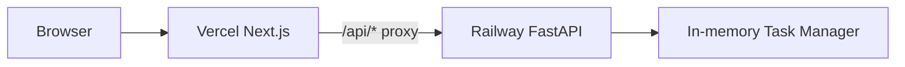

# Generic Task Panel（合規版本）

此專案已新增一套「後端 FastAPI + 前端 Next.js」的通用任務面板，不包含自動註冊、驗證繞過或任何不合規流程。

- 後端：[`backend/app/main.py`](backend/app/main.py)
- 前端：[`frontend/app/page.tsx`](frontend/app/page.tsx)

---

## 架構



---

## 1) 部署後端（Railway）

### 檔案位置
- 依賴檔：[`backend/requirements.txt`](backend/requirements.txt)
- 啟動設定：[`backend/Procfile`](backend/Procfile)
- Railway 設定：[`backend/railway.json`](backend/railway.json)

### 服務建立步驟
1. 在 Railway 建立新專案，選擇從 GitHub 匯入。
2. **Root Directory 一定要設定為 `backend`**。
3. Railway 會自動安裝 [`backend/requirements.txt`](backend/requirements.txt)。
4. 啟動命令使用：
   - `uvicorn app.main:app --host 0.0.0.0 --port $PORT`

> 若你把 Root Directory 指到 repo 根目錄，常見錯誤是「No python entrypoint found」。
> 本專案已提供根目錄入口檔 [`main.py`](main.py) 與 [`backend/main.py`](backend/main.py)，但仍建議用 `backend` 當 Root Directory，避免安裝到錯誤依賴清單。

### 後端環境變數
在 Railway 設定：

- `API_BEARER_TOKEN`：後端 API 保護用 token（建議必填）
- `CORS_ORIGINS`：允許來源，例如：
  - `https://your-frontend.vercel.app`
  - 多個來源用逗號分隔

### 驗證
部署完成後打開：
- `https://<railway-domain>/`（後台管理 UI）
- `https://<railway-domain>/health`

若 `/health` 回傳 `{"ok": true, ...}` 代表成功。

### 後台管理 UI（嵌入 FastAPI）
- 路由入口：`/`（對應 [`backend/app/static/admin.html`](backend/app/static/admin.html)）
- 後端路由：[`admin_ui()`](backend/app/main.py:197)
- 若你有設定 `API_BEARER_TOKEN`，請在頁面上方輸入 token（不含 `Bearer` 前綴）

---

## 2) 部署前端（Vercel）

### 檔案位置
- 前端主頁：[`frontend/app/page.tsx`](frontend/app/page.tsx)
- 代理路由：
  - [`frontend/app/api/start/route.ts`](frontend/app/api/start/route.ts)
  - [`frontend/app/api/stop/route.ts`](frontend/app/api/stop/route.ts)
  - [`frontend/app/api/status/route.ts`](frontend/app/api/status/route.ts)
  - [`frontend/app/api/results/route.ts`](frontend/app/api/results/route.ts)
- 代理共用：[`frontend/app/api/_backend.ts`](frontend/app/api/_backend.ts)

### 服務建立步驟
1. 在 Vercel 匯入同一個 repo。
2. Project Root 設為 `frontend`。
3. Build Command 用預設 `next build`。
4. Output 由 Next.js 自動處理。

### 前端環境變數（Vercel）
設定以下變數：

- `BACKEND_BASE_URL`：Railway API 網址（例如 `https://xxx.up.railway.app`）
- `NEXT_PUBLIC_API_BASE_URL`：同上（供 client 使用）
- `API_BEARER_TOKEN`：與 Railway 的 `API_BEARER_TOKEN` 相同

---

## 3) 本地開發

### 啟動後端
```bash
cd backend
python -m venv .venv
# Windows
.venv\Scripts\activate
pip install -r requirements.txt
uvicorn app.main:app --reload --host 0.0.0.0 --port 8000
```

### 啟動前端
```bash
cd frontend
npm install
npm run dev
```

並建立 [`frontend/.env.example`](frontend/.env.example) 對應的 `.env.local`。

---

## 4) API 規格（FastAPI）

後端實作在 [`backend/app/main.py`](backend/app/main.py)：

- `GET /health`：健康檢查
- `POST /start`：啟動任務
  - body:
    - `task_name: string`
    - `total_steps: number`
    - `interval_seconds: number`
- `POST /stop`：停止任務
- `GET /status`：查詢狀態
- `GET /results?limit=200`：查詢最新結果

---

## 5) 安全建議

1. 前後端都設定 `API_BEARER_TOKEN`。
2. Railway 的 `CORS_ORIGINS` 只允許你的 Vercel 網域。
3. 不要把任何敏感資訊硬編碼在 [`frontend/app/page.tsx`](frontend/app/page.tsx) 或 Git 倉庫。

---

## 6) 後續可擴充

- 把 in-memory 結果改為 PostgreSQL 儲存
- 在 [`backend/app/main.py`](backend/app/main.py) 增加任務佇列（Celery/RQ）
- 在 [`frontend/app/page.tsx`](frontend/app/page.tsx) 加入登入與角色權限
